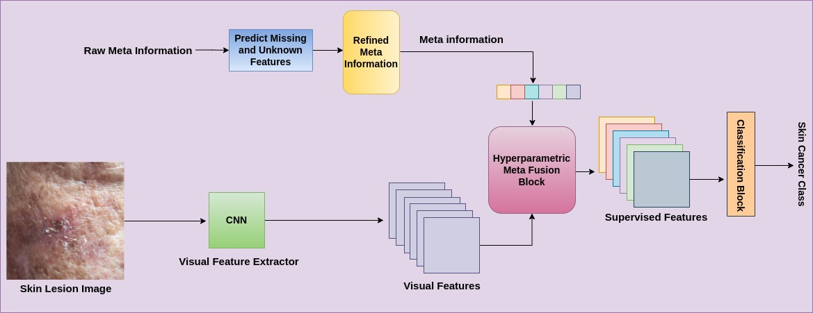

# Hyperparametric Meta Fusion Block
<!-- Towards Improved Skin Lesion Classification using Metadata Supervision -->

==============================================================================================

**[Towards Improved Skin Lesion Classification using Metadata Supervision]**<br>
[Anshul Pundhir](https://anshulpundhir.github.io/), [Saurabh Dadhich](https://www.linkedin.com/in/saurabh-dadhich-a496a8197/), [Ananya Agarwal](https://www.linkedin.com/in/ananya-agarwal-500597192), and [Balasubramanian Raman](http://faculty.iitr.ac.in/~balarfma/)  


<!---->


Setup and Dependencies
----------------------
1. Install Anaconda or Miniconda distribution and create a conda environment with **Python 3.8+**.
2. Install the requirements using the following command:
```sh
pip install -r Requirements.txt
```
3. Download the [PAD-UFES-20 dataset] and keep in `data` folder.
4. Rest of the data files are already provided in the	repository.

Note- regarding prediction of missing metadata in PAD-UFES 20 dataset
----------------------
1. In the Missing Metadata Prediction directory, the CSV file added contains the entire metadata with the values we have predicted; it does not contain any missing or unknwown data. 
2. The 0 values represent FALSE, and 1 represents TRUE in Boolean value columns. 
3. The 0 values represent FEMALE, and 1 represents MALE in the gender column.
4. The feature 'biopsed' jsut provides general information regarding whether the diagnosis of the lesion sample had been confirmed by a biopsy or not, hence we have not used it as a fetaure for predicting missing metadata, nor while finally training the end-to-end CNN + Hyperparametric-Meta-Fusion Block pipeline. 

<!---
If you use this code in your published research, please consider citing:
```text
@inproceedings{}
```
--->
